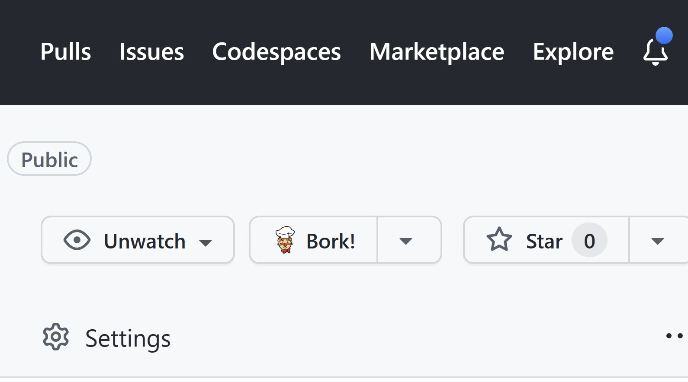

# GitHub Bork Bork Bork

> Chuonges zee-a furk buottun tu burk [^1]

[^1]: Swedish chef speak for "Changes the fork button to bork"

This is a *very silly* Chrome extension that changes the "Fork" button in GitHub to "Bork!" because, why not?

That's it.

That's all it does.

I originally wrote it based on a fun comment made by [Nathalie Leenders](http://www.nathalieleenders.com/) during a [Sharing is Caring](https://pnp.github.io/sharing-is-caring/) "First-Time Contributor" session (where everyone gets to make their first-ever GitHub pull request).

She wrote this comment in the chat:

> My mind cannot unhear bork instead of fork, does help to make github funny 🤭 (Swedish chef)

Of course, I replied:

> Oh my god, I'm totally writing a browser extension to rename \`Fork\` to \`Bork!\` in GitHub

And promptly wrote this extension. It isn't pretty, it isn't even good code... I just wanted to have the Swedish chef saying "Bork" on GitHub from that moment on.

I also made a "cheater" version of it using [Refined GitHub](https://github.com/refined-github/refined-github) and some CSS (Nathalie wrote [a cool blog post about it](http://www.nathalieleenders.com/Blog/index.php/;focus=STRATP_com_cm4all_wdn_Flatpress_42136159&path=?x=entry:entry230113-092810#C_STRATP_com_cm4all_wdn_Flatpress_42136159__-anchor)).

This is the result. Use at your own risk.

## Minimum path to awesome

1. Clone this repo
1. Run `npm install`
1. Run `npm run build`
1. Follow the [instructions to test your extension](https://support.google.com/chrome/a/answer/2714278?hl=en), using the content of the **dist** folder when it is time to **Load unpacked**.
1. Visit any GitHub repo.
1. Ask yourself why you wasted your valuable time on this.
